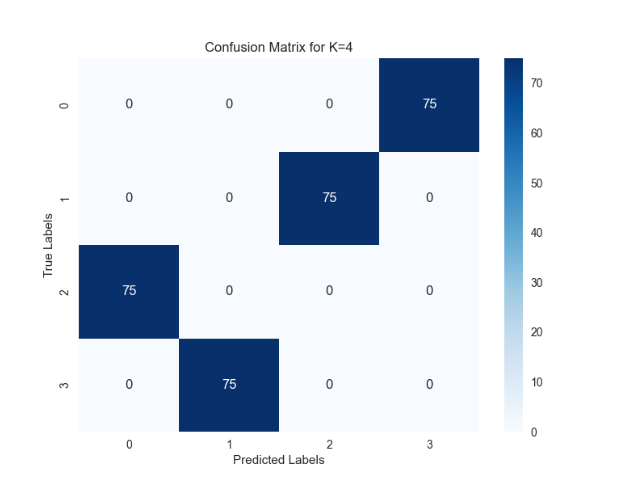

# K-Means Clustering with Elbow Method

## Team Member
- Aaron Campbell 
(campbella20@students.ecu.edu)

## Quick Start To run the Project:

pip install -r requirements.txt

run python hw2.py under HW_elbow_kmeans

## Which K works the best?

Using the KElbowVisualizer, I found that the optimal K value is 4.

## The Best K Accuracy
The calculated accuracy for K=4, based on cluster-label matching, is 100%.

## Confusion Matrix for K=4

## (Ran in pycharm)